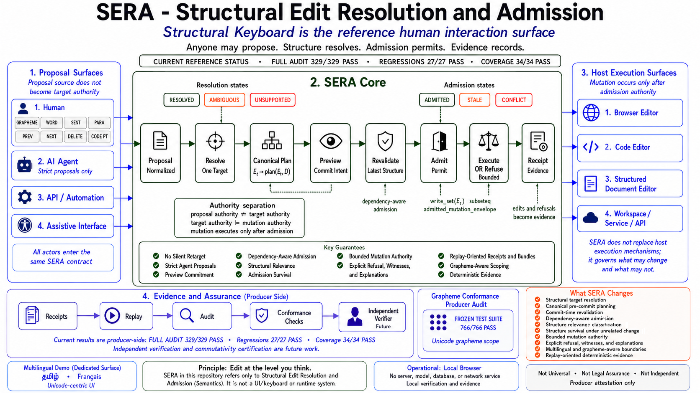

# ⌨️ **SERA — Structural Edit Resolution and Admission**

## **Structural Keyboard Reference Surface**

### **A Deterministic Structural Admission Boundary Between Edit Proposals and Mutation**


[](https://github.com/OMPSHUNYAYA/SERA/actions/workflows/sera-verify.yml)

---

# **Anyone may propose. Structure resolves. Admission permits. Evidence records.**

SERA is an edit-admission architecture first. Structural Keyboard is its human reference surface.

SERA inserts a declared structural boundary between an edit proposal and actual mutation authority:

`proposal -> resolve -> plan -> preview -> revalidate -> admit -> execute OR refuse -> receipt`

governed by:

`proposal authority != target authority != mutation authority`

A human, AI agent, API, assistive system, or other declared source may propose an edit.

The proposal source does not automatically determine the exact target.

A resolved target does not automatically authorize mutation.

A canonical plan does not automatically receive authority to write outside the structure required by that plan.

A proposal that cannot be safely resolved, whose committed structural meaning is no longer current, or whose plan exceeds its admitted mutation envelope is explicitly refused.

The refusal itself becomes evidence.

The human-facing reference implementation is **Structural Keyboard**:

# **Edit at the level you think.**

> **Naming note:** SERA in this repository refers only to **Structural Edit Resolution and Admission** within the Shunyaya ecosystem and is unrelated to other uses of the same acronym.

---

# 🏗️ **SERA Architecture at a Glance**

[](docs/SERA-Architecture-Diagram.png)

A visual overview of the SERA proposal-to-mutation boundary, from proposal surfaces through structural resolution, admission, bounded execution, and evidence.

---

# 🚀 **Try It in 60 Seconds**

1. Open [`demo/SERA_Structural_Keyboard_Reference_Demo_v0_9_2.html`](demo/SERA_Structural_Keyboard_Reference_Demo_v0_9_2.html) in a current browser.
2. Use **Schema** and **Scope** to move between structural levels such as `GRAPHEME`, `CODE_POINT`, `WORD`, `SENTENCE`, and `PARAGRAPH`.
3. Open **Agent Proposal** to see a machine-originated proposal enter the same resolution and admission contract used by the human surface.
4. Open **Refusal Challenge** to see a prepared edit become `STALE` and refuse mutation after its target meaning changes.
5. Open **Compare Current Target** to compare a forced target choice with SERA's live structural result.
6. Load **Boundary Challenge** to expose punctuation and ambiguity limits.
7. Load **Multilingual Demo** to work with the current Tamil and French demonstration content.
8. Open the developer console and run:

```javascript
await SERA_AUDIT.runAll()
```

Current verified principal result:

```text
TOTAL                    329/329 PASS
INTEGRITY REGRESSION     0
UNEXPECTED MUTATION      0
FEATURE COVERAGE         PASS
FINAL STATUS: PASS
```

The complete group listing printed above this summary also reports:

`KNOWN REGRESSIONS = 27/27 PASS`

`FEATURE COVERAGE = 34/34 PASS`

This is a **producer-side browser reference audit** under:

`SERA-AUDIT-1-D04`

It is not independent verification.

---

# 🤖 **The Problem SERA Targets: Machine Edits Without Machine Authority**

An AI agent, automation layer, API, or other system may emit:

`patch`

`range`

`replacement`

`workspace edit`

`raw coordinates`

`structural locator`

If that output is applied directly, proposal output can become practical mutation authority.

SERA separates:

`what was proposed`

from:

`what target actually resolves`

from:

`what exact plan represents the edit`

from:

`whether that plan is still current`

from:

`where that plan may write`

The intended machine-editing relation is:

`agent proposes -> SERA resolves and admits -> host executes`

which separates:

`model proposal quality != edit-admission correctness`

Three broad failure classes are central.

## **Silent Mis-Targeting**

A generated range or inferred location refers to the wrong structural unit, yet mutation proceeds.

## **Stale Application**

The structure required by an edit changes after proposal or preview, while the old edit remains executable.

## **Over-Broad Mutation**

A narrow declared intent produces a broader write than the admitted plan requires.

SERA addresses these through one authority chain:

`untrusted proposal -> independently resolved target -> canonical plan -> preview commitment -> commit-time revalidation -> bounded mutation authority -> execution OR refusal -> evidence`

---

# 🧠 **Proposal Authority Is Not Target Authority**

The current implementation supports canonical proposal identity through:

`SERA-PROPOSAL-1-D01`

A proposal may declare:

- proposal identity;
- source;
- schema;
- scope;
- locator;
- action;
- payload;
- expected profile;
- optional expected document identity;
- optional range hint.

Declared proposal sources include:

`HUMAN`

`AI_AGENT`

`API`

`ASSISTIVE_TECHNOLOGY`

The source is evidence.

`proposal source != target authority`

The current strict machine profile is:

`SERA-AGENT-STRICT-1-D01`

Under this profile:

`machine-supplied range = locator hint`

not:

`machine-supplied range = mutation authority`

A mismatching machine range does not silently replace the independently resolved structural target.

The governing path remains:

`proposal -> resolve -> plan -> preview -> revalidate -> admit -> execute OR refuse`

---

# 🛑 **The Refusal Is the Feature**

SERA is defined not only by what it can execute, but also by what it refuses to execute.

The core law is:

`uncertain target OR invalidated meaning OR excess authority -> no silent mutation`

Resolution may return:

`RESOLVED`

`AMBIGUOUS`

`UNSUPPORTED`

Admission may return:

`ADMITTED`

`STALE`

`CONFLICT`

A valid refusal preserves:

`zero mutation + explicit state + declared reason + evidence`

The current refusal-witness profile is:

`SERA-REFUSAL-WITNESS-1-D01`

The current reference surface includes a dedicated **Refusal Challenge** that demonstrates:

`RESOLVED + PREVIEWED`

followed by a structural change, then:

`STALE`

`TARGET_STALE`

`NO MUTATION`

A refusal is therefore not merely an error path.

**A refusal is a successful SERA outcome when the declared edit cannot be safely resolved or admitted.**

Every surfaced refusal may also carry a plain-language explanation for human understanding.

The evidence and presentation layers remain separate:

`refusal witness = deterministic evidence`

`refusal explanation = human-readable interpretation`

`explanation != evidence authority`

---

# 🔒 **No Silent Retarget Law**

A proposal must not silently execute against a different target from the one represented by its active preview commitment.

The governing law is:

`preview_target_fingerprint != commit_target_fingerprint -> no execution under old commitment`

A valid continuation requires:

`re-resolve -> new preview -> new commitment -> new admission`

The old commitment may remain as evidence.

It must not transfer authority to the newly resolved target.

This applies regardless of proposal source:

`HUMAN`

`AI_AGENT`

`API`

`ASSISTIVE_TECHNOLOGY`

The current audit permanently covers this invariant:

`NO SILENT RETARGET = 6/6 PASS`

---

# ⚙️ **The Core Contract**

| Stage | Question |
|---|---|
| Proposal | What edit is being requested? |
| Resolve | What supported structural target, if any, does the proposal identify? |
| Plan | What exact classical edit plan represents the structural action? |
| Preview | What exact target and plan are being presented for commitment? |
| Revalidate | Do the target and required structural dependencies still mean the same thing? |
| Admit | Is the committed plan still permitted under the active profile? |
| Execute | Apply only the admitted plan inside its declared mutation envelope. |
| Refuse | Produce an explicit non-mutating result. |
| Receipt | Record the declared transition or refusal. |

A compact view is:

```text
PROPOSER
   |
   v
PROPOSAL
   |
   v
RESOLUTION ---------> AMBIGUOUS / UNSUPPORTED ---------> REFUSAL
   |
   v
CANONICAL PLAN
   |
   v
PREVIEW COMMITMENT
   |
   v
COMMIT-TIME REVALIDATION
   |
   v
ADMISSION ----------> STALE / CONFLICT ----------------> REFUSAL
   |
   v
MUTATION ENVELOPE
   |
   v
BOUNDED EXECUTION
   |
   v
EDIT RECEIPT
```

The architectural relationship is:

`SERA = core edit-resolution and admission contract`

`Structural Keyboard = reference human interaction surface`

`proposal adapters = human, agent, API, and assistive proposal surfaces`

`schema providers = structural interpretation sources`

`host adapters = execution surfaces`

---

# 📐 **Canonical Planning**

Let:

`E_s = structural edit intent`

`D = canonical document state`

Then:

`E_c = plan(E_s, D)`

where:

`E_c = canonical classical edit plan`

Current plan operations include forms such as:

`DELETE_RANGE(start, end)`

`INSERT_AT(position, content)`

`REPLACE_RANGE(start, end, content)`

The governing relation is:

`same structural intent + same canonical state + same planning profile -> same canonical plan`

Planning is deliberately distinct from the wider Shunyaya collapse operator.

`plan(E_s, D) -> canonical edit construction`

`phi((m, a)) = m -> Shunyaya collapse`

The two operations are not conflated.

---

# 👁️ **Preview Commitment v2**

The current preview profile is:

`SERA-PREVIEW-COMMIT-2-D01`

The preview commitment binds the exact target, admission subject, action, canonical plan, and mutation envelope presented before commitment.

Conceptually:

`preview_commitment = H(profile + target_fingerprint + admission_fingerprint + action + canonical_plan + mutation_envelope)`

The governing law is:

`executed admitted plan = previewed committed plan`

If the plan changes:

`plan changed -> STALE -> re-resolve -> re-preview`

If the target changes:

`target changed -> old commitment cannot execute`

A non-mutating current-state check may report:

`CURRENTLY VALID`

`CURRENTLY STALE`

`CURRENTLY CONFLICTING`

These are informative checks.

`CURRENTLY VALID != ADMITTED`

Final admission remains commit-time.

---

# ✅ **Commit-Time Admission**

The current admission profile is:

`SERA-ADMISSION-DEP-1-D01`

Admission returns:

`ADMITTED`

`STALE`

`CONFLICT`

Only:

`RESOLVED + ADMITTED -> execution`

## **ADMITTED**

The target, dependencies, canonical plan, preview commitment, and mutation envelope remain valid under the active profile.

## **STALE**

The earlier committed structural meaning is no longer current.

Examples include:

- target content changed;
- target boundary changed;
- required context changed;
- destination relation changed;
- canonical plan changed.

## **CONFLICT**

The proposal cannot be safely admitted under the declared profile.

Examples include:

- mutation-envelope violation;
- invalid movement destination;
- incompatible structural dependency change;
- incompatible concurrent mutation.

---

# 🔗 **Dependency-Aware Admission**

SERA separates:

`document_hash`

from:

`admission_fingerprint`

The document hash identifies the complete canonical document.

The admission fingerprint identifies the structure on which one proposal actually depends.

Conceptually:

`admission_fingerprint = H(declared admission dependencies)`

Examples include:

## **DELETE**

`target + required separator context`

## **MOVE**

`source target + source context + destination relation + destination context`

## **PASTE**

`insertion anchor + insertion relation + separator policy`

This supports the Relevant Change Principle:

`irrelevant change must not automatically invalidate valid edit authority`

paired with:

`dependency-changing mutation must not silently preserve old edit authority`

The resulting relation is:

`unrelated change -> authority may survive`

`relevant change -> authority must be re-established`

The current reference also demonstrates Structural Admission Survival:

`document changed AND required dependencies unchanged -> prepared authority may remain valid`

This is not equivalent to ignoring concurrent change.

The proposal is revalidated against the target, declared dependencies, canonical plan, preview commitment, and mutation envelope.

The current Structural Relevance classification distinguishes:

`IRRELEVANT`

`DEPENDENCY_RELEVANT`

`TARGET_MUTATING`

`RULES_RELEVANT`

`SCHEMA_RELEVANT`

Conceptually:

`IRRELEVANT -> commitment may survive`

`DEPENDENCY_RELEVANT -> revalidate`

`TARGET_MUTATING -> old commitment cannot execute`

`RULES_RELEVANT -> re-resolve under applicable rules`

`SCHEMA_RELEVANT -> re-resolve under applicable schema`

The central concurrency principle is:

> **Not every concurrent edit is unsafe. Not every changed offset creates a new target. Declared structural dependency determines whether the original proposal still means the same thing.**

The stronger admission objective is:

`safe editing != accept everything`

`safe editing != invalidate everything`

`safe editing = preserve authority exactly while required structure remains valid`

# 🛡️ **Admitted Mutation Envelope**

The current envelope profile is:

`SERA-MUTATION-ENVELOPE-1-D01`

The governing law is:

`write_set(E_c) subseteq admitted_mutation_envelope`

A plan that attempts to write outside its admitted envelope must not execute as admitted.

`plan escape -> CONFLICT`

This is the structural least-authority principle:

`resolved action -> minimum declared mutation authority required for that action`

---

# 🎫 **Structural Edit Permit**

The current permit profile is:

`SERA-EDIT-PERMIT-1-D01`

Conceptually:

`permit = H(profile + target_fingerprint + dependency_fingerprint + plan_hash + mutation_envelope)`

A permit is:

- proposal-bound;
- target-bound;
- dependency-bound;
- plan-bound;
- envelope-bound;
- single-use after successful commit.

Structural validity is not the same as higher-level authorization.

A SERA permit does not replace:

- access control;
- user authorization;
- organizational policy;
- application permissions;
- legal authorization.

---

# 🧱 **Dependencies Reduced from Sole Authority**

SERA preserves familiar editing mechanisms while changing their authority role.

| Domain | Dependency no longer treated as sole authority | Structural basis |
|---|---|---|
| Human editing | Manual precision selection | Declared scope + structural resolution |
| Agent and API editing | Raw diff, range, or proposal output | Resolution + canonical planning + admission |
| Concurrent proposals | Whole-document change as universal invalidator | Declared admission dependencies |
| Mutation execution | Unconstrained host execution | Admitted mutation envelope |
| Edit evidence | Producer interface as the only account of what happened | Receipts + replay-oriented evidence |

The project-level dependency statement is:

> **SERA explores whether document mutation can be governed by declared structural resolution and admission rather than allowing manual range construction, machine-generated edit output, or host execution mechanics to remain the sole authority over what changes.**

---

# ⌨️ **Structural Keyboard — The Human Reference Surface**

Structural Keyboard demonstrates that the same edit-admission contract can govern both machine and human proposals.

The current reference surface includes:

- Schema;
- persistent Scope;
- interactive TARGET state;
- interactive ADMISSION state;
- structural navigation;
- structural position;
- Agent Proposal;
- Refusal Challenge;
- Compare Current Target;
- Reset Demo;
- Boundary Challenge;
- Multilingual Demo;
- Select;
- Cut;
- Copy;
- Paste;
- Delete;
- Duplicate;
- Move Back;
- Move Forward;
- Undo;
- Redo;
- Save;
- evidence export;
- keyboard shortcuts;
- cumulative console audit.

The value of the surface is not merely structural selection.

It makes the authority chain visible:

`proposal -> target -> plan -> admission -> bounded mutation -> evidence`

---

# 🧭 **Schemas and Structural Scope**

| Schema | Identity | Version | Scopes |
|---|---|---|---|
| TEXT | `writing.basic` | `1.1.0` | `GRAPHEME`, `CODE_POINT`, `WORD`, `SENTENCE`, `PARAGRAPH` |
| MARKDOWN | `markdown.basic` | `1.1.0` | `GRAPHEME`, `CODE_POINT`, `WORD`, `SENTENCE`, `PARAGRAPH`, `LIST_ITEM`, `SECTION` |

The selected scope is persistent visible state.

Examples:

`GRAPHEME + Next -> next extended grapheme cluster`

`SENTENCE + Delete -> delete current sentence`

`PARAGRAPH + Duplicate -> duplicate current paragraph`

`SECTION + Next -> next Markdown section`

---

# ↔️ **Structural Navigation and Position**

Previous and Next navigate structural units rather than individual raw positions.

The reference surface follows the selected target visually.

`explicit structural navigation -> selected target becomes visible`

The interface also exposes a scope-aware structural position such as:

`Sentence 1 of 6`

`Paragraph 2 of 4`

`Word 7 of 28`

`Grapheme 4 of 19`

---

# 🌐 **Multilingual Demo**

The current reference surface includes a dedicated **Multilingual Demo** separate from **Boundary Challenge**.

Current languages:

`Tamil`

`French`

The Tamil demonstration uses the finalized three-sentence content:

> நீங்கள் மாற்ற விரும்பும் பகுதியை முதலில் தெளிவாக கண்டறியலாம். நீங்கள் ஒரு வார்த்தை, ஒரு வாக்கியம் அல்லது ஒரு பத்தியை மிக எளிதாகத் தேர்ந்தெடுத்து திருத்தலாம். எந்தப் பகுதியை மாற்ற வேண்டும் என்பது தெளிவாகத் தெரியவில்லை என்றால், யூகிக்க முயற்சிப்பதை விட நிறுத்துவதே பாதுகாப்பானது.

The French demonstration expresses the same general editing idea in French.

The multilingual demo is designed to grow without changing its generic identity.

The current permanent regression law is:

`Multilingual Demo != Boundary Challenge`

and:

`declared Tamil and French demo content -> permanently covered`

The dedicated console diagnostic is:

```javascript
SERADemo.runMultilingualDemoCheck()
```

Current verified result:

`PASS`

The diagnostic checks include:

- multilingual content remains separate;
- Tamil content is present;
- French content is present;
- Tamil sentence count is three;
- French sentence count is three;
- declared sentences match;
- no unintended sentence ambiguity is introduced;
- Tamil grapheme behavior remains valid;
- French accented-character behavior remains valid.

---

# 🌍 **Unicode, Graphemes, and Multilingual Boundaries**

The current grapheme profile is:

`SERA-UNICODE-GRAPHEME-1-D01`

It declares:

`unicode_version = 17.0.0`

`segmentation_specification = UAX_29`

`segmentation_revision = 47`

`grapheme_mode = EXTENDED_GRAPHEME_CLUSTER`

`tailoring = NONE`

The evidence offset unit remains:

`UTF16_CODE_UNIT`

The human-facing structural units include:

`GRAPHEME`

and:

`CODE_POINT`

These are different layers.

`UTF16_CODE_UNIT != UNICODE_CODE_POINT`

`UNICODE_CODE_POINT != EXTENDED_GRAPHEME_CLUSTER`

`grapheme resolution unit != evidence offset unit`

Current covered examples include:

- Tamil sequences such as `கி`;
- Tamil word behavior;
- joiner-based emoji such as `👩‍💻`;
- canonical-equivalence cases;
- complex-script sequences;
- UTF-16 span conversion.

The frozen grapheme conformance command is:

```javascript
SERADemo.runFrozenGraphemeConformance()
```

Current verified result:

`766/766 PASS`

The reference implements grapheme segmentation internally against the declared frozen profile and validates it against the frozen 766-vector conformance corpus rather than delegating segmentation authority to a browser-provided segmentation API.

This keeps declared grapheme behavior reproducible across browser and engine versions under the frozen profile.

The project preserves the distinction:

`Unicode algorithm conformance != universal linguistic correctness`

---

# ⚠️ **Boundary Challenge**

Boundary Challenge remains focused on difficult English-oriented sentence-boundary behavior such as:

- abbreviations;
- decimals;
- ellipses;
- repeated forms;
- punctuation boundaries;
- missing spaces;
- ambiguous sentence endings.

Its purpose is to expose the resolver boundary rather than hide it.

Multilingual content is intentionally kept in the separate **Multilingual Demo**.

---

# ⚖️ **Compare Current Target**

Compare Current Target uses:

`current editor content + current caret + current scope`

It does not depend on a separate fixed sample.

Results appear automatically when the comparison opens.

The user may then choose:

`Run Again`

The comparison is illustrative.

It does not establish universal superiority over other editing systems.

---

# 🧪 **Admission Boundary Matrix**

The current reference implementation includes a deterministic **Admission Boundary Matrix**.

For one frozen proposal, surrounding structure is changed systematically to ask:

`which changes actually matter to this proposal?`

Representative outcomes include:

`unrelated earlier change -> may remain ADMITTED`

`unrelated later change -> may remain ADMITTED`

`target content change -> STALE`

`target boundary change -> STALE`

`required destination relation change -> STALE OR CONFLICT`

`mutation-envelope escape -> CONFLICT`

The current audit result is:

`ADMISSION BOUNDARY = 9/9 PASS`

---

# 🔄 **Concurrency: Admission, Not Merging**

SERA does not define a collaborative merge algorithm.

Its concern is narrower:

`given a prepared proposal, does that proposal still have sufficient structural authority to execute now?`

The current **Two-Agent Structural Admission Races** demonstration uses:

`DRAFT_AGENT`

and:

`REVIEW_AGENT`

starting from the same declared state.

Three deterministic races are shown.

## **Same Target**

Both agents act on the same structural unit.

The later prepared proposal is revalidated against changed target structure.

Representative classification:

`TARGET_MUTATING`

The old authority does not silently transfer.

## **Unrelated Change**

One agent changes distant structure while the other proposal retains the same target and required dependencies.

Representative classification:

`IRRELEVANT`

The document hash changes, but the prepared proposal may remain:

`ADMITTED`

This is the visible Structural Admission Survival case.

## **Required Dependency Changes**

One agent changes structure required by the other proposal, such as a movement destination.

Representative classification:

`DEPENDENCY_RELEVANT`

The earlier proposal must be revalidated and may become:

`STALE`

or:

`CONFLICT`

The governing distinction is:

`state reconciliation != edit admission`

A merge or reconciliation layer may determine how concurrent state combines.

SERA governs whether a particular prepared proposal still retains structural authority.

The two architectures may be layered.

# 🧾 **Evidence, Receipts, and Session Bundles**

The current receipt profile is:

`SERA-RECEIPT-2`

The current session bundle profile is:

`SERA-SESSION-BUNDLE-2`

Current receipt kinds include:

`GENESIS`

`EDIT`

`REFUSAL`

`UNDO`

`REDO`

Evidence may bind:

- proposal identity;
- proposal source;
- schema identity;
- rules profile;
- scope;
- resolution state;
- candidate choice;
- target fingerprint;
- action;
- canonical plan;
- plan hash;
- admission fingerprint;
- mutation envelope;
- mutation-envelope hash;
- preview commitment;
- permit identity;
- refusal witness;
- pre-document hash;
- post-document hash;
- previous receipt hash.

The replay relation is:

`genesis document + validated receipt chain + frozen profiles -> replayable final document`

The current browser also generates verifier-oriented fixtures.

Those fixture checks remain producer-side.

`producer fixture generation != independent verification`

---

# 🔐 **Canonical Identity**

The current conformance architecture separates multiple identity domains:

`doc_hash`

`proposal_hash`

`target_fingerprint`

`candidate_set_hash`

`plan_hash`

`admission_fingerprint`

`mutation_envelope_hash`

`preview_commitment`

`permit_id`

`refusal_witness_hash`

`receipt_hash`

These identities have different subjects and must not be treated as interchangeable.

The canonical document relation is:

`doc_hash = SHA256(UTF8(NFC(LF-normalized document)))`

The canonical structured-hash relation is:

`hash = SHA256(UTF8(canonicalJSON(subject)))`

The exact current rules are defined in:

[`docs/specs/SERA_Conformance_v0_2_0.txt`](docs/specs/SERA_Conformance_v0_2_0.txt)

---

# 🧭 **Where SERA Stands Among Existing Mechanisms**

Structural navigation, syntax-aware selection, tree editing, range editing, patching, version checks, and collaborative reconciliation are established mechanism classes.

SERA does not claim novelty merely because it can act on structural units.

Its bounded differentiation lies in the combined declared contract joining:

`independent target resolution`

`+ canonical pre-commit planning`

`+ No Silent Retarget`

`+ commit-time structural revalidation`

`+ dependency-aware admission`

`+ bounded mutation authority`

`+ actor-independent proposal handling`

`+ explicit evidenced refusal`

`+ replay-oriented evidence`

The comparison below describes common architectural properties of mechanism classes, not universal behavior of every implementation.

Individual systems may add additional validation, identity tracking, conflict handling, or evidence layers.

---

# 📊 **Edit-Admission Property Comparison**

| Property | Direct patch / range application | Character-offset editing | Whole-document version admission | Collaborative reconciliation | Structural / tree editing | SERA |
|---|---|---|---|---|---|---|
| What determines the practical target? | Supplied patch or coordinates | Active caret or selection coordinates | Proposal coordinates after version validation | Operation plus reconciliation model | Selected structural object | Independent structural resolution; supplied coordinates may remain locator hints |
| Does the proposal artifact directly determine the executable target? | Commonly | Commonly | Commonly after coarse validation | The operation and reconciliation model determine the resulting effect | Commonly within the structural model | No; proposal information is distinct from target and mutation authority |
| Required structure changes concurrently | May fail, relocate, misapply, or be rejected depending on mechanism | Depends on how position identity is maintained | Proposal is rejected when the resource version changes | Operation is reconciled according to the model | Depends on structural identity and revalidation | `STALE` or `CONFLICT`; no admitted mutation under old authority |
| Unrelated structure changes concurrently | Depends on patch and coordinate behavior | Depends on coordinate maintenance | Commonly invalidates the whole proposal | Reconciled according to the collaboration model | Varies | May remain admissible when declared dependencies remain unchanged |
| Check/use gap | Mechanism-dependent | Mechanism-dependent | Version check protects the checked version boundary | Not inherently an edit-admission contract | Model-dependent | Preview commitment plus commit-time structural revalidation |
| Write boundary | Patch-defined | Action-defined | Edit-defined after validation | Model-defined | Structural-model-defined | Admitted mutation envelope |
| Changed target under old commitment | Mechanism-dependent | Mechanism-dependent | Version change may block use, but target correctness remains inherited from the proposal | Transformation is governed by the reconciliation model | Model-dependent | Prohibited by the No Silent Retarget Law |
| Explicit refusal evidence | Mechanism-dependent | Usually outside the core mechanism | Version-conflict evidence may exist | Mechanism-dependent | Mechanism-dependent | First-class typed refusal witness plus human-readable explanation |
| Replay-oriented transition evidence | Mechanism-dependent | Usually outside the core mechanism | Version history only unless extended | Operation logs may exist | Mechanism-dependent | Deterministic chained receipts and session bundles |
| Proposal-source identity in the admission contract | Usually outside the core mechanism | Usually outside the core mechanism | Usually outside the core mechanism | Usually outside the core mechanism | Usually outside the core mechanism | Declared as evidence; source identity does not become target authority |

The architectural distinction is:

`editing mechanism asks: how is the change represented or applied?`

`reconciliation mechanism asks: how are concurrent states combined?`

`SERA asks: may this particular proposed mutation execute against the structure that now exists?`

SERA therefore complements rather than replaces ranges, patches, structural models, version controls, or collaborative reconciliation.

# 🏗️ **Position in the Shunyaya Ecosystem**

SERA is developed within the **Shunyaya Framework**.

Its edit-boundary relation is:

`proposal -> structural meaning -> exact plan -> current validity -> bounded authority -> execution -> evidence`

Its ecosystem-level dependency row is:

| Domain | Dependency eliminated from sole authority | Structural basis |
|---|---|---|
| Editing | Manual range construction and raw machine edit output as mutation authority | Structural resolution + dependency-aware admission + bounded mutation authority + receipts |

---

# 🧮 **Informative State Alignment with the Wider Shunyaya Vocabulary**

| SERA state | Nearest normalized class | Interpretation |
|---|---|---|
| `RESOLVED` | `RESOLVED` | One supported target under frozen rules |
| `AMBIGUOUS` | `ABSTAIN` | Multiple valid interpretations remain or one is intentionally not forced |
| `UNSUPPORTED` | `INCOMPLETE` or `FORBIDDEN` | Reason-dependent unavailable or excluded interpretation |
| `ADMITTED` | `RESOLVED` at admission stage | Commit-time structural requirements remain satisfied |
| `STALE` | `ABSTAIN` | Old commitment requires re-resolution or re-preview |
| `CONFLICT` | `CONFLICT` | Structure cannot be safely admitted under the active profile |

The preferred cross-layer representation is:

`native_stage_state + normalized_admissibility_class + reason_code`

This alignment is informative.

SERA's native states remain normatively defined by the SERA specifications.

---

# ✅ **Current Reference Status: SERA v0.9.2**

Reference surface:

**Structural Keyboard v0.9.2**

Primary audit profile:

`SERA-AUDIT-1-D04`

| Check | Result |
|---|---:|
| Full release audit | **329/329 PASS** |
| Built-in self-test | **54/54 PASS** |
| Known regressions | **27/27 PASS** |
| Feature coverage | **34/34 PASS** |
| Frozen grapheme conformance | **766/766 PASS** |
| Multilingual Demo check | **PASS** |
| Audit harness | **4/4 PASS** |
| State restoration | **1/1 PASS** |
| Integrity regression | **0** |
| Unexpected mutation | **0** |
| Independent verification | **Not yet claimed** |

## **Full-Audit Groups**

| Group | Result |
|---|---:|
| Core | **26/26 PASS** |
| Resolution | **7/7 PASS** |
| Editing | **5/5 PASS** |
| Admission | **5/5 PASS** |
| Preview | **5/5 PASS** |
| No Silent Retarget | **6/6 PASS** |
| Proposals | **16/16 PASS** |
| Refusal Witnesses | **11/11 PASS** |
| Comparison | **9/9 PASS** |
| Demo Flows | **11/11 PASS** |
| Interaction | **3/3 PASS** |
| Viewport | **4/4 PASS** |
| Status Controls | **4/4 PASS** |
| Structural Position | **4/4 PASS** |
| Button Affordance | **21/21 PASS** |
| Concurrency | **9/9 PASS** |
| Admission Boundary | **9/9 PASS** |
| Evidence | **10/10 PASS** |
| UI | **21/21 PASS** |
| Keyboard | **10/10 PASS** |
| Unicode | **13/13 PASS** |
| Built-In Self-Test | **54/54 PASS** |
| State Restoration | **1/1 PASS** |
| Audit Harness | **4/4 PASS** |
| Known Regressions | **27/27 PASS** |
| Feature Coverage | **34/34 PASS** |

The current result is a **producer-side browser reference audit**.

It must not be presented as independent verification.

---

# 🧪 **Verify It Yourself**

Open the browser developer console.

## **Full Release Gate**

```javascript
await SERA_AUDIT.runAll()
```

Expected current result:

```text
TOTAL                    329/329 PASS
INTEGRITY REGRESSION     0
UNEXPECTED MUTATION      0
FEATURE COVERAGE         PASS
FINAL STATUS: PASS
```

## **Quick Audit**

```javascript
await SERA_AUDIT.quick()
```

Current verified result:

`102/102 PASS`

The quick audit is intended for local iteration and fast deterministic verification.

Its current composition contains no layout-dependent checks, so it can also run in headless DOM environments without a rendering engine.

The complete full release gate includes viewport and focus-behavior checks that require a real rendering browser.

The quick audit does not replace the complete full release gate.

The current verification roles are therefore:

`quick audit -> fast deterministic and headless-compatible reference checks`

`full release audit -> complete producer-side verification in a rendering browser`

`independent verifier -> future reconstruction of declared evidence outside the producer implementation`

## **Multilingual Demo Check**

```javascript
SERADemo.runMultilingualDemoCheck()
```

Expected principal result:

`PASS`

## **Frozen Grapheme Conformance**

```javascript
SERADemo.runFrozenGraphemeConformance()
```

Expected:

`766/766 PASS`

## **Feature Coverage**

```javascript
SERA_AUDIT.coverage()
```

Expected after a complete full audit:

`UNCOVERED FEATURES = 0`

## **Known Regressions**

```javascript
SERA_AUDIT.regressions()
```

Expected:

`27/27 PASS`

## **Last Complete Full Audit**

```javascript
SERA_AUDIT.lastFull()
```

## **Audit Session Status**

```javascript
SERA_AUDIT.status()
```

## **Current Structural State**

```javascript
SERA_AUDIT.inspect()
```

## **Audit Requirements**

```javascript
SERA_AUDIT.requirements()
```

---

# 🧰 **Focused Audits**

```javascript
await SERA_AUDIT.runCore()
await SERA_AUDIT.runResolution()
await SERA_AUDIT.runEditing()
await SERA_AUDIT.runAdmission()
await SERA_AUDIT.runPreview()
await SERA_AUDIT.runNoSilentRetarget()
await SERA_AUDIT.runProposals()
await SERA_AUDIT.runRefusalWitnesses()
await SERA_AUDIT.runComparison()
await SERA_AUDIT.runDemoFlows()
await SERA_AUDIT.runInteraction()
await SERA_AUDIT.runViewport()
await SERA_AUDIT.runStatusControls()
await SERA_AUDIT.runStructuralPosition()
await SERA_AUDIT.runButtonAffordance()
await SERA_AUDIT.runConcurrency()
await SERA_AUDIT.runAdmissionBoundary()
await SERA_AUDIT.runEvidence()
await SERA_AUDIT.runUI()
await SERA_AUDIT.runKeyboard()
await SERA_AUDIT.runUnicode()
```

Each focused audit prints its own group result and explicit final status.

Quick and focused audits do not erase the archived latest complete full audit.

---

# 🧯 **Permanent Regression Discipline**

The current permanent regression registry contains:

`27 regression requirements`

The latest additions protect refusal explainability and dependency-aware concurrency:

`REG-026 -> Every surfaced refusal must remain understandable without requiring the user to interpret hashes or reason codes alone.`

`REG-027 -> Agent Admission Races must preserve the distinction between unrelated change, target mutation, and required-dependency change.`

The Multilingual Demo separation remains permanently protected by:

`REG-025 -> Multilingual Demo must remain separate from Boundary Challenge and preserve the declared Tamil and French content`

The governing development law is:

`bug found -> fix implemented -> permanent regression test added -> full audit must pass`

The intended assurance relation is:

`implemented feature -> declared audit coverage -> permanent regression protection`

---

# 🛠️ **Browser Local-File Notice**

A browser may log a message similar to:

```text
'file:' URLs are treated as unique security origins
```

when the single-file demo is opened directly through a `file:` URL.

This is a browser security-origin notice.

The current SERA v0.9.2 reference demo completed its verified full release audit while opened locally despite that notice.

The notice does not by itself indicate:

- application failure;
- audit failure;
- evidence failure.

---

# 📚 **Release Documentation**

- [Quickstart](docs/Quickstart.md)
- [FAQ](docs/FAQ.md)
- [Architecture Diagram](docs/SERA-Architecture-Diagram.png)
- [Console Audit Commands](docs/SERA_v0_9_2_Console_Audit_Commands.txt)
- [Verification Guide](verify/VERIFY.md)

---

# 📚 **Technical Specifications**

## **Architecture At A Glance**

[`docs/SERA_Architecture_At_A_Glance_v1_0.md`](docs/SERA_Architecture_At_A_Glance_v1_0.md)

Provides the compact entry point for:

- authority separation;
- the proposal-to-receipt pipeline;
- the Relevant Change Principle;
- Structural Admission Survival;
- structural relevance classification;
- No Silent Retarget;
- mutation-envelope least authority;
- generic mechanism comparison.

## **Core Architecture**

[`docs/specs/SERA_Core_Architecture_v0_9_2.txt`](docs/specs/SERA_Core_Architecture_v0_9_2.txt)

Defines:

- project identity;
- authority separation;
- proposal-to-mutation pipeline;
- target resolution;
- canonical planning;
- preview commitment;
- No Silent Retarget;
- dependency-aware admission;
- mutation envelopes;
- structural edit permits;
- actor-independent proposals;
- strict machine proposal handling;
- refusal witnesses;
- concurrency;
- multilingual and grapheme architecture;
- evidence architecture;
- deployment direction;
- claim boundaries.

## **Canonicalization, Conformance, and Evidence**

[`docs/specs/SERA_Conformance_v0_2_0.txt`](docs/specs/SERA_Conformance_v0_2_0.txt)

Defines:

- canonical document text;
- canonical JSON;
- UTF-8 SHA-256 identity;
- proposal canonicalization;
- strict agent proposal semantics;
- offset semantics;
- target fingerprints;
- candidate-set hashes;
- canonical plans;
- admission fingerprints;
- mutation envelopes;
- preview commitment v2;
- No Silent Retarget conformance;
- structural edit permits;
- refusal witnesses;
- receipt v2;
- session bundle v2;
- grapheme profile;
- conformance vectors;
- differential-conformance direction;
- independent-verifier boundary.

## **Audit and Assurance**

[`docs/specs/SERA_Audit_and_Assurance_v0_9_2.txt`](docs/specs/SERA_Audit_and_Assurance_v0_9_2.txt)

Defines:

- `SERA-AUDIT-1-D04`;
- the complete 329-test release gate;
- focused and quick audits;
- permanent regression discipline;
- feature coverage;
- state restoration;
- audit-result persistence;
- Multilingual Demo assurance;
- frozen grapheme assurance;
- release acceptance;
- current producer-side assurance boundary;
- independent-verification separation.

---

# 🔬 **Assurance and Deployment Roadmap**

The current assurance level is:

`producer-side browser regression assurance`

The next major assurance milestone remains:

`independent replay verification`

The recommended progression is:

## **1. Freeze the Verifier-Facing Evidence Boundary**

Preserve the current versioned canonical identities for:

- proposals;
- canonical plans;
- preview commitments;
- refusal witnesses;
- receipts;
- session bundles;
- replay inputs.

## **2. Publish Frozen Conformance and Adversarial Corpora**

Separated corpus families may include:

`SERA-CANON-1`

`SERA-RESOLVE-ADV-1`

`SERA-ADMIT-ADV-1`

`SERA-REPLAY-1`

`SERA-UNICODE-1`

and later:

`SERA-COMMUTE-1`

## **3. Implement the Independent Verifier**

The verifier should independently reconstruct:

`genesis document + validated receipt chain + frozen profiles -> final document identity`

It should not reuse the browser's internal verification implementation.

It should reject at least:

- modified genesis;
- modified canonical plan;
- modified receipt;
- broken previous-receipt link;
- invalid mutation-envelope evidence;
- permit reuse where forbidden;
- refusal mutation;
- unexpected reconstructed final identity.

## **4. Publish Refusal-Inclusive Evidence Corpora**

The public corpus should contain both admitted edits and refusals.

A useful bounded target is:

`unsafe silent mutations = 0`

within the declared frozen corpus and profiles.

## **5. Implement an Independent Second Resolver**

The second resolver tests semantic agreement rather than receipt replay.

`independent verifier -> did the recorded transition chain reconstruct correctly?`

`independent resolver -> did another implementation independently reach the same declared structural result?`

## **6. Expand Multilingual Demonstration and Review**

The Multilingual Demo may add further languages while retaining one generic demonstration identity.

Additional language-specific human review should remain separate from normative Unicode algorithm conformance.

## **7. Add Bounded Commutativity Certification**

A future profile may certify whether two admitted plans commute under one frozen pre-state and profile set.

---

# 📏 **Measurable Evaluation Direction**

Future evaluation may measure:

`false admission rate`

`false refusal rate`

`explicit ambiguity rate`

`silent mis-target rate`

`unsafe silent mutations`

`mis-targeted forced edits prevented`

`stale proposal detection`

`mutation-envelope violations prevented`

`range-hint authority violations`

`silent retarget attempts blocked`

Human-side evaluation may additionally measure:

`manual range-construction actions`

`pointer precision actions`

`total interaction count`

`repair actions`

`task completion time`

`targeting errors`

A particularly useful evaluation artifact is the current **Admission Boundary Matrix**, which asks:

> **Which changes actually matter to this proposal?**

---

# ⚖️ **Claim Boundary**

SERA and Structural Keyboard are a reference architecture, implementation, and research program.

The current project demonstrates:

- deterministic structural target resolution;
- explicit non-resolution;
- canonical proposal identity;
- strict machine range-as-hint handling;
- canonical planning;
- preview commitment v2;
- No Silent Retarget;
- commit-time dependency-aware admission;
- mutation envelopes;
- structural edit permits;
- explicit refusal witnesses;
- actor-independent proposal handling;
- receipt v2 and session bundle v2 evidence;
- producer-side replay-oriented evidence;
- `GRAPHEME` and `CODE_POINT` scope separation;
- a dedicated Tamil and French Multilingual Demo;
- frozen grapheme conformance;
- cumulative regression assurance.

The project does not currently claim:

- universal linguistic correctness;
- that every structural target can always be resolved;
- superiority over expert-optimized editors;
- replacement of conventional selection;
- replacement of collaborative merge systems;
- replacement of host transaction systems;
- production readiness by default;
- independent verification;
- second-resolver agreement;
- external authenticity from an unanchored receipt chain;
- automatic accessibility benefit;
- legal, regulatory, or safety certification;
- that a hash establishes authorship or external truth;
- that the 329/329 browser audit proves absence of all defects;
- that generic Unicode conformance proves every language-specific editing behavior.

The current bounded principle is:

`uncertainty or invalidated authority -> explicit non-mutation`

not:

`uncertainty -> forced edit`

---

# 🧪 **How to Challenge SERA**

Useful falsification targets include:

- a case where `RESOLVED` silently chooses an incorrect supported target;
- equivalent canonical inputs producing different canonical identities;
- a stale proposal that still mutates;
- a changed target that executes under an old preview commitment;
- a machine range hint that bypasses independent target resolution;
- an unrelated edit that incorrectly invalidates an independent proposal;
- a dependency-changing edit that incorrectly remains admitted;
- a canonical plan that changes after preview but still commits under the old commitment;
- a plan that writes outside its admitted mutation envelope;
- a permit that can be reused after successful commit;
- a refusal that changes the document;
- a refusal witness that changes nondeterministically;
- a receipt chain that passes despite a broken previous link;
- a quick or focused audit that erases the last complete full-audit evidence;
- a declared feature with no permanent coverage;
- a supported frozen grapheme vector that is split incorrectly;
- a Multilingual Demo regression that merges multilingual content back into Boundary Challenge;
- a Tamil or French demonstration sentence that introduces unintended resolver ambiguity under the declared test.

A reproducible counterexample is more useful than a broad claim.

---

# ♿ **Accessibility and Assistive Direction**

The current keyboard audit is:

`10/10 PASS`

It includes deterministic keyboard workflow and focus behavior.

This strengthens the reference interaction boundary.

It does not by itself prove universal accessibility benefit.

Actual accessibility outcomes require dedicated evaluation with relevant users and assistive technologies.

---

# 🧩 **Current Development Discipline**

The reference project follows:

`bug found -> fix implemented -> permanent regression test added -> full audit must pass`

The current demonstrated state is:

`27 permanent regressions`

`34 declared feature coverage families`

The objective is:

`discover each deterministic bug once`

---

# 📜 **License**

See: [LICENSE](LICENSE)

This repository is a publicly available reference implementation provided under the license terms stated in the repository.

Architecture documentation is subject to the applicable licensing terms declared in the repository, including CC BY-NC 4.0 where stated.

This repository does not claim recognition as a formal technical standard.

---

# **Final Principle**

## **Anyone may propose. Structure resolves. Admission permits. Evidence records.**

For the Structural Keyboard reference surface:

## **Edit at the level you think.**
